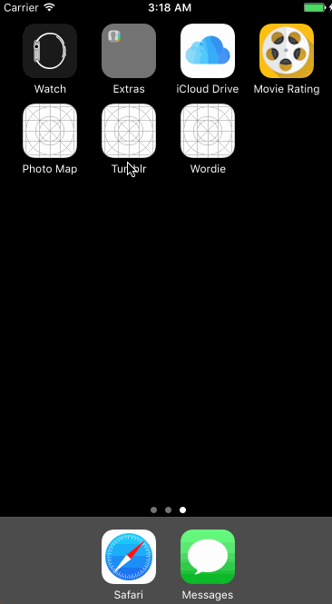

# Lab6_Photo_Map

Canvas is an app allow the user to take a photo, tag it with a location, and then see a map with all the previously tagged photos.

Time spent: 5 hours spent in total

## User Stories

The following **required** functionality is completed:

- [x] User can see the Map View
- [x] User can Take a Photo or choose one in the photo library
- [x] User can Tag a Location
- [x] User can Drop a Pin

The following **additional** features are implemented:

## Video Walkthrough

Here's a walkthrough of implemented user stories:

